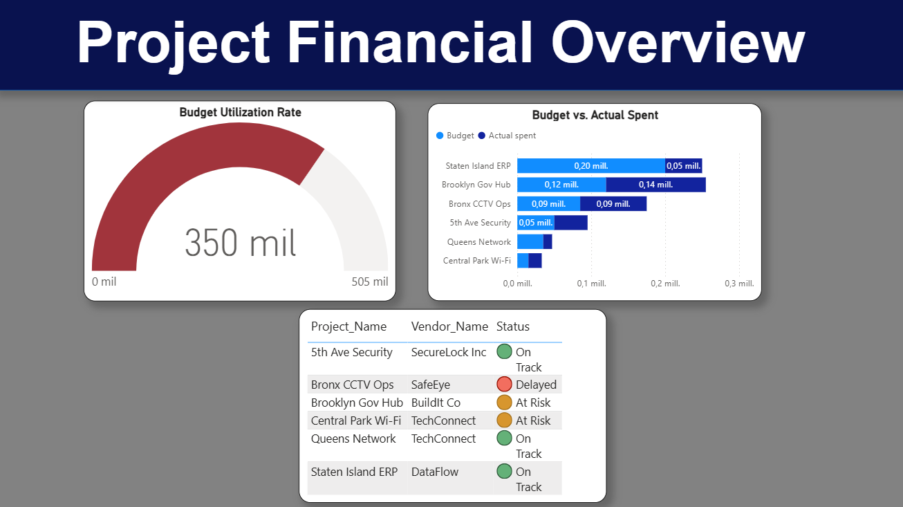

# 🗽 NY Project Operations & Financial Dashboard

## 📊 Descripción del Proyecto
Este Dashboard fue diseñado para monitorear la salud financiera de proyectos operativos en New York. El objetivo es identificar desviaciones presupuestarias y estados críticos de ejecución mediante el análisis de datos SQL.

## 🛠️ Tecnologías utilizadas
* **SQL:** Extracción y limpieza de datos (Queries de varianza).
* **Power BI:** Visualización de datos y diseño de Dashboard Ejecutivo.
* **Excel/CSV:** Gestión del dataset original de proyectos.

## 📈 Dashboard Preview

## 🔑 Key Insights
* **Brooklyn Gov Hub:** Identificado como proyecto crítico con 15% de excedente presupuestario.
* **Queens Logistics:** Marcado "At Risk" por falta de ejecución de fondos.
* **Optimization:** Se simplificó la vista de fechas para reportes de gerencia.
